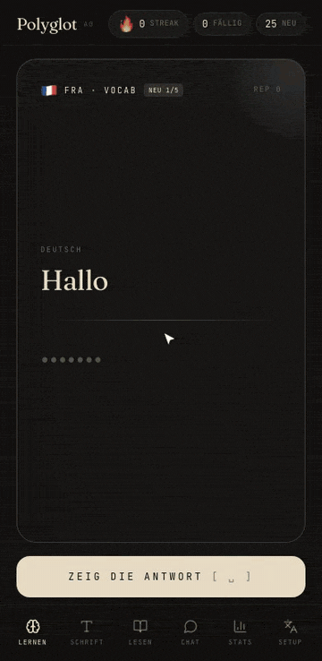

# Polyglot

[](https://github.com/22wayan/polyglot-app/actions/workflows/ci.yml)

A language learning app for five languages at once: French, Spanish, Indonesian, Russian and Chinese. It combines spaced-repetition flashcards with a script trainer and an AI conversation tutor, and installs on a phone as a progressive web app.

I built it because I learn these five languages in parallel and no app handled that well.

**Live demo: [polyglot-app-five.vercel.app](https://polyglot-app-five.vercel.app)**. Flashcards and the script trainer work right away; for the AI tabs, enter your own Anthropic key in the Setup tab.



*Flashcards with FSRS scheduling, the script trainer and the progress view, recorded with `docs/record-demo.mjs`. The AI tabs need an API key, see below.*

## Features

- **Spaced repetition with FSRS-4.** Each card is scheduled by the open-source FSRS algorithm, the same family of models Anki uses.
- **Script trainer** for Cyrillic and Chinese characters, with pinyin and transliteration.
- **AI tutor.** You chat in the target language; the tutor answers, corrects your sentence, explains the correction and suggests new words you can add as cards with one tap.
- **AI card generation.** New cards on request, without duplicates of what you already know.
- **Beginner stories.** Short AI-written stories (A0 level) with a translation for every sentence and key words you can add as cards.
- **Local-first.** All progress lives in IndexedDB on the device, with export and import as backup.

The interface is in German, and cards go from German to the target language. Five languages are active by default; switch them in the Setup tab.

## Architecture

- **Frontend:** React 18, Vite, Tailwind CSS, Dexie.js for IndexedDB, vite-plugin-pwa
- **AI:** Claude Sonnet for the tutor, Claude Haiku for cheap card generation, with prompt caching for the tutor's system prompt
- **Bring your own key:** every user enters their own Anthropic key in the Setup tab. It is stored only in that browser and sent only to `api.anthropic.com`; the app has no server that sees it, and nobody spends someone else's credit.
- **Optional proxy for self-hosting:** a Vercel function (`api/generate.js`) can hold one server-side key instead, with an origin check, a per-IP rate limit and an optional app token.
- **Robustness:** model answers are validated and normalised at the boundary, so empty or malformed fields never reach the UI.

## Run it yourself

Requires Node 20 or newer.

```bash
npm install
npm run dev                      # http://localhost:5173
```

Without an API key the app works as a plain flashcard and script trainer; the AI tabs show a lock screen.

### Enable the AI features

Open the Setup tab, paste your Anthropic API key and press *Key prüfen und speichern*. The app checks the key against Anthropic's models endpoint, which costs no tokens, and keeps it in `localStorage` on this device only. *Key von diesem Gerät entfernen* deletes it again. Get a key at [console.anthropic.com](https://console.anthropic.com/settings/keys) and set a monthly spend limit there.

The key is readable by any script running on the page, so only use it in a build you trust, such as your own deployment or `npm run dev`.

### Self-hosting with a server key (optional)

If you deploy for people who should not need their own key, put one key on the server instead:

1. Deploy to Vercel (`npx vercel`) and set `ANTHROPIC_API_KEY` in the project settings, see `.env.example`.
2. Optional: set `VITE_APP_TOKEN` on both sides to reject requests without the token.
3. Set a monthly spend limit. The proxy limits each IP to 12 requests per minute and caps prompts and tokens, but anyone who finds the URL can use your credit.

A key entered in the Setup tab always wins over the server key. For local tests of the proxy run `npx vercel dev`.

## Development

```bash
npm test          # Vitest: scheduler, parsing, own-key path, API proxy, IndexedDB layer
npm run lint      # ESLint with React and hooks rules
npm run build     # production build into dist/
```

CI runs lint, tests, build and a secret scan on every push. `AGENTS.md` explains the code layout and rules for coding agents.

```
api/generate.js        Vercel function, Anthropic proxy with origin check and rate limit
src/fsrs.js            FSRS-4 scheduler, pure functions
src/apiKey.js          the user's own key in localStorage
src/aiRequest.js       Messages API request body, shared by browser and proxy
src/aiParse.js         parsing and validation of model answers
src/ai.js              prompts and API calls
src/db.js              Dexie schema, seed data, backup export and import
src/components/        one file per tab plus shared UI
tests/                 Vitest suites
```

## Known limitation

Speech recognition is disabled in the iOS home-screen app, because WebKit does not support it there reliably.

## License

MIT
